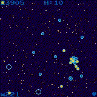
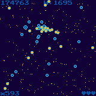
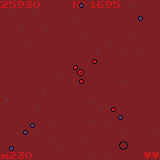
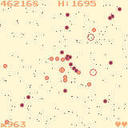
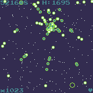
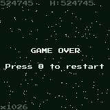
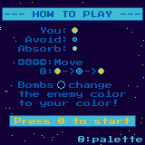
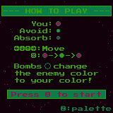

# disk-0 MADNESS













A game written in Rust for the [WASM-4](https://wasm4.org) fantasy console.
Pronounce it how you want: "Disco madness" / "Disk O' madness" / "Disk-Zero madness".


### How to play
You are a lone space-disk in an unfriendly territory, survive for as long as you can!
1. Absorb enemies of your color to gain points
2. Avoid enemies of opposite colors (they will hurt you!)
3. Switch your color strategically
4. Use bombs to turn surrounding enemies into absorbable ones!
### Controls [Keyboard]:
- Move with directional arrows ⬅⬇⬆➡
- Press __X__ to change your disk's color in game
- Press __Z__ anytime to change the game's palette.
### Controls [Mouse]:
 - Hold the __right__ mouse button and the player's disk will follow the pointer.
 - __Left__ click to change your disks's color in game
 - __Middle__ click anytime to change the game's palette

## Building the game

Build the cart by running:

```shell
cargo build --release
```

Then run it with:

```shell
w4 run target/wasm32-unknown-unknown/release/cart.wasm
```

For more info about setting up WASM-4, see the [quickstart guide](https://wasm4.org/docs/getting-started/setup?code-lang=rust#quickstart).

## Links (WASM4 fantasy console)

- [Documentation](https://wasm4.org/docs): Learn more about WASM-4.
- [Snake Tutorial](https://wasm4.org/docs/tutorials/snake/goal): Learn how to build a complete game
  with a step-by-step tutorial.
- [GitHub](https://github.com/aduros/wasm4): Submit an issue or PR. Contributions are welcome!
