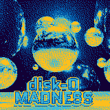
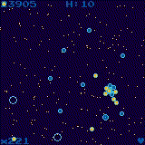
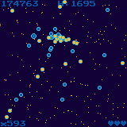
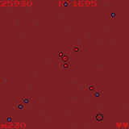
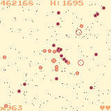
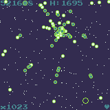
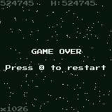
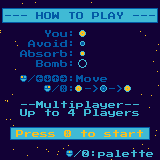

# disk-0 MADNESS












A game written in Rust for the [WASM-4](https://wasm4.org) fantasy console.
Pronounce it how you want: "Disco madness" / "Disk O' madness" / "Disk-Zero madness".


## How to play
You are a lone space-disk in an unfriendly territory, survive for as long as you can!
1. Absorb enemies of your color to gain points
2. Avoid enemies of opposite colors (they will hurt you!)
3. Switch your color strategically
4. Use bombs to turn surrounding enemies into absorbable ones!
### Controls [Keyboard]:
- Move with directional arrows ⬅⬇⬆➡
- Press __X__ to change your disk's color in game
- Press __Z__ anytime to change the game's palette.
### Controls [Mouse]:
 - Hold the __left__ mouse button and the player's disk will follow the pointer.
 - __Right__ click to change your disks's color in game
 - __Middle__ click anytime to change the game's palette

## Multiplayer instructions
### Local Multiplayer
Local multiplayer is where everyone is playing on the same computer.
__To play local multiplayer, you can connect multiple physical USB controllers. Xbox or PlayStation controllers are known to work best.__

If all you have is a keyboard, up to 3 players can be controlled from one keyboard using these keys:

| Player # |Directions| X button| Z button |
|---:|:----:  |:----:  |:----:  |
|1 |Arrows |. (period)| , (comma)|
|2 |ESDF |A or Q |Tab or LShift|
|3 |Numpad 8456 |Numpad * or .|Numpad - or Enter|

This key layout is designed to fit many hands on one keyboard somewhat comfortably.

## Netplay

Hosting a netplay game is as easy as copy and pasting a link.

While playing any cart, press Enter to open the WASM-4 menu.
Select "Copy Netplay URL". An invite link (like https://wasm4.org/netplay/#ABCDEF) will be copied to your clipboard for you to send to a friend.
When your friend clicks your link, they'll instantly join your game.

Some caveats:
Mouse input is disabled during netplay.
State saving/loading and cart reset is currently disabled during netplay.
Netplay is new and there may be bugs, please [report issues](https://github.com/aduros/wasm4).
## Building the game

Build the cart by running:

```shell
cargo build --release
```

Then run it with:

```shell
w4 run target/wasm32-unknown-unknown/release/cart.wasm
```
##
For more info about setting up WASM-4, see the [quickstart guide](https://wasm4.org/docs/getting-started/setup?code-lang=rust#quickstart).

## Links (WASM4 fantasy console)

- [Documentation](https://wasm4.org/docs): Learn more about WASM-4.
- [Snake Tutorial](https://wasm4.org/docs/tutorials/snake/goal): Learn how to build a complete game
  with a step-by-step tutorial.
- [GitHub](https://github.com/aduros/wasm4): Submit an issue or PR. Contributions are welcome!
